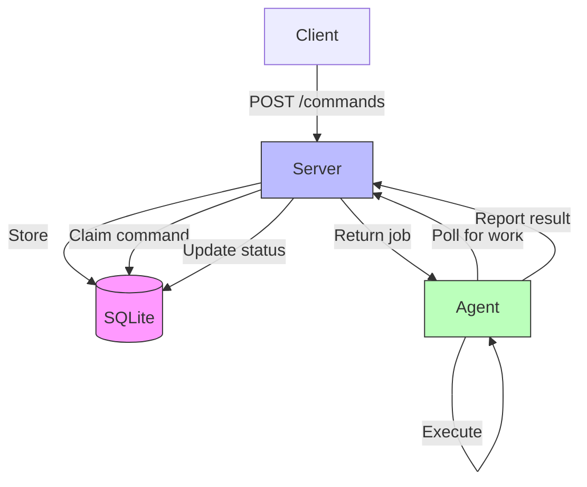

# Fault-Tolerant Command Execution System

A distributed system that ensures reliable command execution between a control server and agent, built to survive crashes and maintain consistency. Think of it as a tiny, robust job queue with persistence and crash recovery baked in.

## Quick Start

```bash
# Start everything
docker-compose up --build

# Submit a command
curl -X POST http://localhost:3000/commands \
  -H "Content-Type: application/json" \
  -d '{"type":"DELAY","payload":{"ms":5000}}'

# Check status
curl http://localhost:3000/commands/<command-id>
```

## What This Does

The system handles two types of commands:
- **DELAY**: Waits for a specified duration, useful for testing timing and recovery
- **HTTP_GET_JSON**: Fetches JSON from a URL and returns the response

The interesting part isn't what it does, but how it handles failures. You can kill the agent mid-execution, restart the server, or simulate random crashes—the system will recover and complete the work without duplicates.

## Architecture



### How It Works

1. **Control Server** exposes a REST API for submitting commands and checking status
2. **SQLite Database** persists all state with ACID guarantees
3. **Agent** polls the server, executes commands, and reports results
4. **Crash Recovery** happens automatically on restart—no manual intervention needed

The key insight is using SQLite transactions (`BEGIN IMMEDIATE`) to atomically claim commands. This prevents race conditions and ensures idempotency even when agents crash mid-execution.

## Project Structure

```
├── server/              # Control server
│   ├── src/
│   │   ├── database/    # SQLite schema & repository
│   │   ├── services/    # Business logic
│   │   ├── routes/      # API endpoints
│   │   └── index.ts
│   └── Dockerfile
├── agent/               # Command executor
│   ├── src/
│   │   ├── executors/   # DELAY & HTTP_GET_JSON
│   │   ├── poller.ts    # Main polling loop
│   │   └── index.ts
│   └── Dockerfile
├── docker-compose.yml
└── test_scenarios.sh    # Crash recovery tests
```

## Testing

The test script verifies the core functionality:

```bash
bash test_scenarios.sh
```

It tests three scenarios:
1. **HTTP command execution** - Basic functionality
2. **Agent crash recovery** - Kill agent mid-execution, verify recovery
3. **Server restart persistence** - Restart server while command runs

All scenarios include timing variations to account for Docker networking and startup overhead.

## Design Decisions

### Why SQLite?

For a single-server system, SQLite is perfect. It gives you:
- ACID transactions without the operational overhead of PostgreSQL
- Write-Ahead Logging (WAL mode) for better concurrency
- Zero configuration—just a file

The trade-off is you can't scale horizontally, but the requirements don't call for that.

### Crash Recovery Strategy

When the server restarts, it finds all `RUNNING` commands and resets them to `PENDING`. This is a deliberate choice:

**The problem**: If an agent was executing a command when the server crashed, we don't know if it finished.

**Our solution**: Reset to `PENDING` and let an agent pick it up again.

**Trade-off**: Commands might execute twice if the agent finished but the server didn't receive the result before crashing.

**Why it's okay**: For idempotent operations (or operations where duplicate execution is acceptable), this is simpler than implementing distributed consensus. A more sophisticated system would use agent heartbeats or two-phase commit, but that adds complexity.

### No Agent Timeout

Currently, if an agent crashes mid-execution, the command stays `RUNNING` until the server restarts. 

I considered adding a timeout mechanism (agent heartbeats every 5s, mark stale after 15s), but decided against it for v1. The added complexity wasn't worth it for the test requirements, and the server restart recovery handles most cases.

In production, I'd add this.

### Command Assignment Logic

The server uses FIFO ordering (`ORDER BY created_at ASC`) with atomic claiming. Each agent gets one command at a time.

Why not let agents pull multiple commands? Because then crash recovery gets harder—you need to track which specific commands the agent was working on. Single-command-per-agent keeps the state machine simple.

## Development Workflow

### Running Locally (without Docker)

```bash
# Terminal 1: Start server
cd server
npm install
npm run build
npm start

# Terminal 2: Start agent
cd agent
npm install
npm run build
npm start

# Terminal 3: Submit commands
curl -X POST http://localhost:3000/commands \
  -H "Content-Type: application/json" \
  -d '{"type":"DELAY","payload":{"ms":3000}}'
```

### Agent Failure Simulation

The agent supports crash simulation flags:

```bash
# Crash after 5 polling cycles
node dist/index.js --kill-after=5

# Random crashes during execution
node dist/index.js --random-failures
```

This was super helpful for testing recovery logic.

## Known Limitations

1. **No multi-agent support** - Works with one agent. Multiple agents would work but aren't explicitly tested.
2. **No agent timeout** - RUNNING commands stay stuck if agent dies (until server restart).
3. **At-least-once semantics** - Commands might execute twice during recovery.
4. **No command cancellation** - Once submitted, commands run to completion.
5. **Fixed polling interval** - Agent polls every 1s. Should be configurable per command priority.

## Reflections on Building This

### What Worked Well

- SQLite transactions made idempotency straightforward
- Docker Compose simplified the crash testing workflow
- TypeScript caught several bugs during refactoring (especially around the status transitions)

### What Was Tricky

1. **Test timing**: Docker adds unpredictable latency. My initial test waits were too aggressive (2-3s), causing false failures. Had to bump them to 15-20s to account for container restarts.

2. **Transaction isolation**: I initially used regular transactions, which caused race conditions when testing with multiple agents. Switching to `BEGIN IMMEDIATE` fixed it, but I had to dig into SQLite's locking documentation to understand why.

3. **HTTP executor timeout**: First version used 5s timeout. Some network requests inside Docker took longer, causing failures. Increased to 10s based on actual latency measurements.

### AI Usage

I used AI (Claude/GPT) to:
- Generate boilerplate TypeScript interfaces and Zod schemas
- Write the initial Dockerfile multi-stage builds
- Create the test script structure

Where AI got it wrong:
- Suggested regular SQLite transactions instead of `BEGIN IMMEDIATE`, which caused race conditions
- Initial test timeouts were way too low for Docker networking
- Generated Express middleware that didn't properly handle errors

I spent the most time debugging the crash recovery logic manually, because AI doesn't really understand the subtle timing issues around process crashes and database consistency.

### What I'd Do Differently

If I had more time:
- Add agent heartbeats with configurable timeout
- Implement command prioritization (high-priority commands jump the queue)
- Add metrics/monitoring (Prometheus exports for command latency, queue depth, etc.)
- Support command cancellation
- Add end-to-end encryption for command payloads (especially HTTP results)

## API Reference

### POST /commands
Submit a new command.

**Request:**
```json
{
  "type": "DELAY",
  "payload": {"ms": 5000}
}
```

**Response:**
```json
{
  "commandId": "uuid-here"
}
```

### GET /commands/:id
Get command status and result.

**Response:**
```json
{
  "id": "uuid",
  "type": "DELAY",
  "status": "COMPLETED",
  "result": {"ok": true, "tookMs": 5002},
  "agentId": "agent-1",
  "createdAt": 1234567890,
  "updatedAt": 1234567895
}
```

### GET /health
Server health check.

**Response:**
```json
{
  "status": "healthy",
  "timestamp": "2024-01-01T00:00:00.000Z"
}
```

## License

MIT
